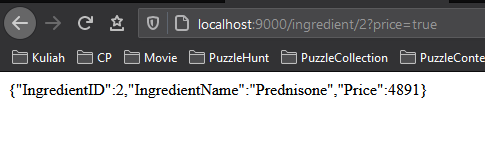

# Choco-Supplier-WebService

1 of 4 part from Chocolate Factory Website

A Web Service made using RESTful API

## Prerequisites

1. Node.js

## Node Libraries

1. BodyParser
1. Express
1. mysql

## Setup

1. Install [Node.js](https://nodejs.org/en/)
2. Install Node Libraries

```
npm install
```

3. Create New MySQL Database

```
mysql -u root -p
<YOUR_PASSWORD>
create database chocosup;
use chocosup;
```

4. Populate Database
   - Copy `chocosupplier20201111.sql` to terminal mysql interface
5. Setup Database Config
   - Copy `application/config/db.config.example.js` to `application/config/db.config.js`
   - Change username, password, and database name
6. Run Server

```
npm start
```

## Database Schema

Ingredient(IngredientID, IngredientName, Price)

### Ingredient



1. GET /ingredient/:id?price=true

> get detail of ingredient of supplied id (optional: price)
>
> output: `Ingredient`

```
Ingredient: {
  "id": integer,
  "name": string,
  "price": integer
}
```

2. GET /ingredient/?price=true

> get detail of all ingredient (optional: price)
>
> output: `array of Ingredient`

3. POST /ingredient/buy/

```
{
  "money": integer,
  "ingredients":[
    {
      "id": integer,
      "amount": integer,
    },
    ...
    {
    "id": integer,
    "amount": integer,
    }
  ]
}
```

> buy an ingredient with some money
>
> output: `integer` (Remaining Money | Needed Money)

4. POST /

```
{
	"ingredientName": string,
	"price": integer
}
```

> creates a new ingredient
>
> output: `integer` inserted id

## Author

[Jonathan Yudi Gunawan](https://github.com/JonathanGun/) - 13518084

## Acknowledgement

This project is made to fulfill IF3110 Website Development course
